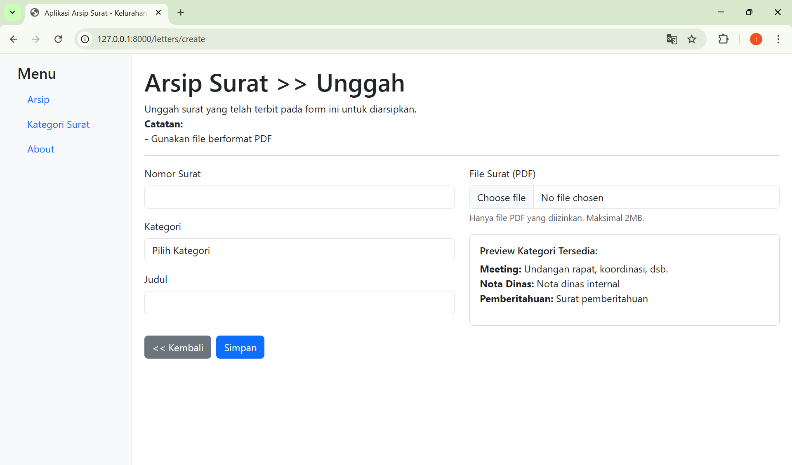
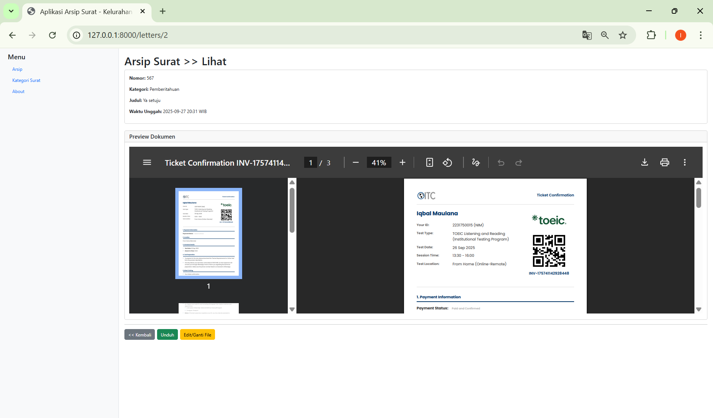
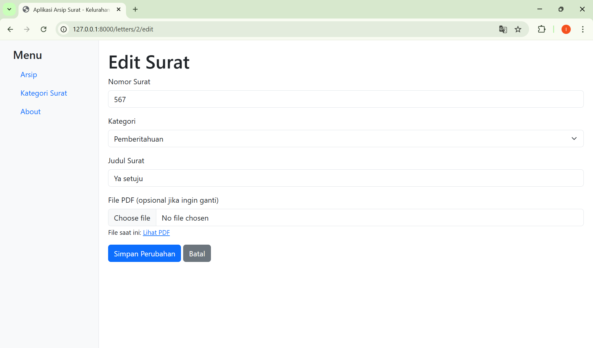
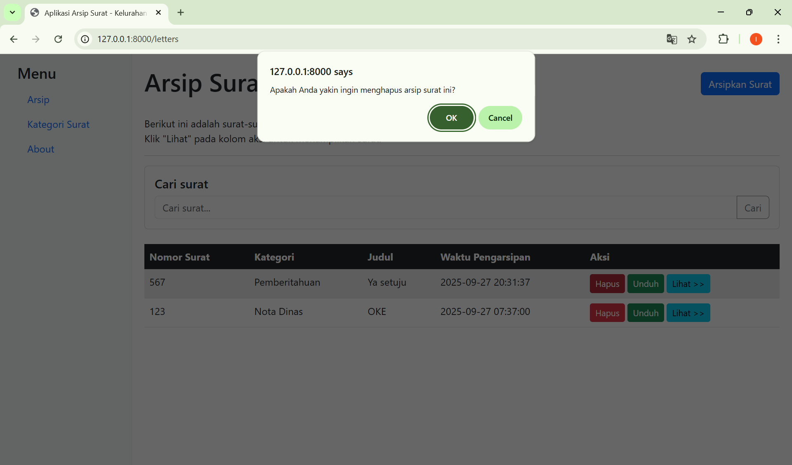
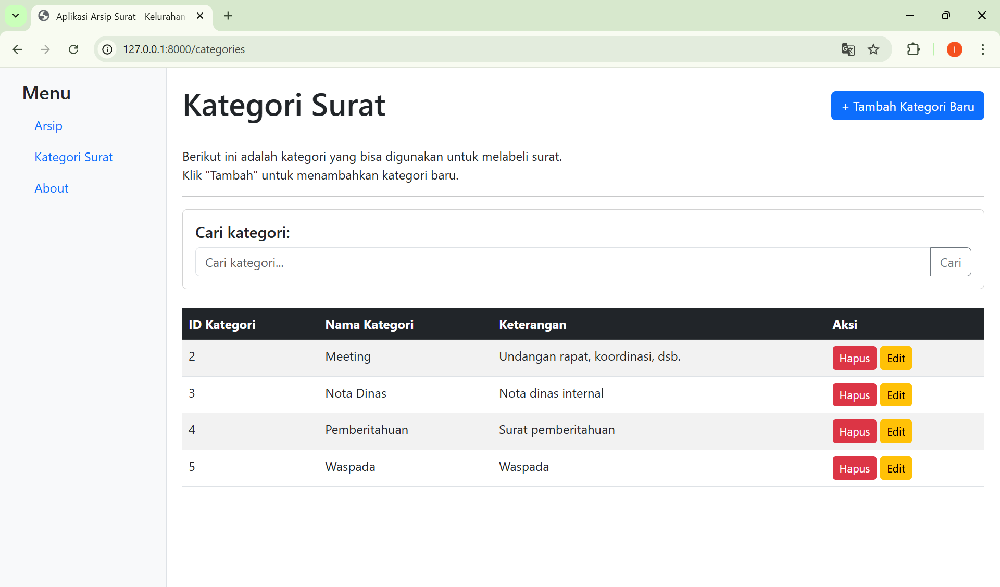
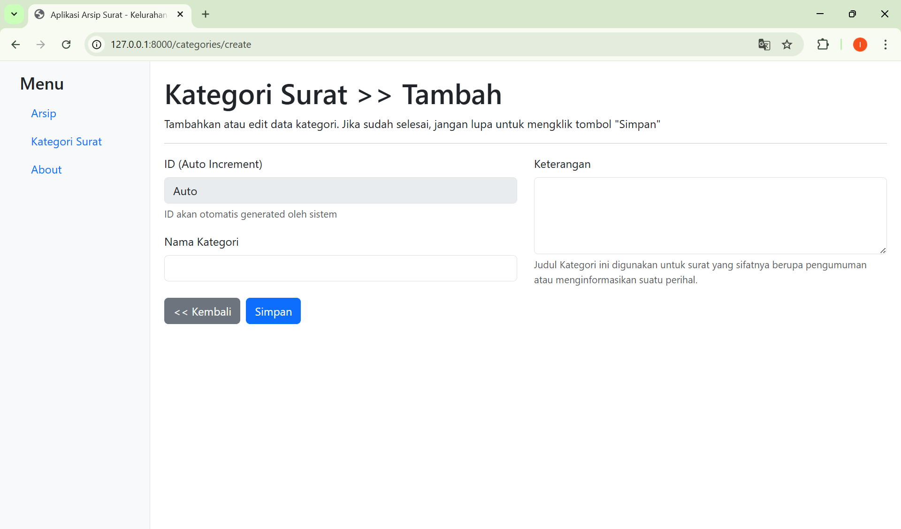
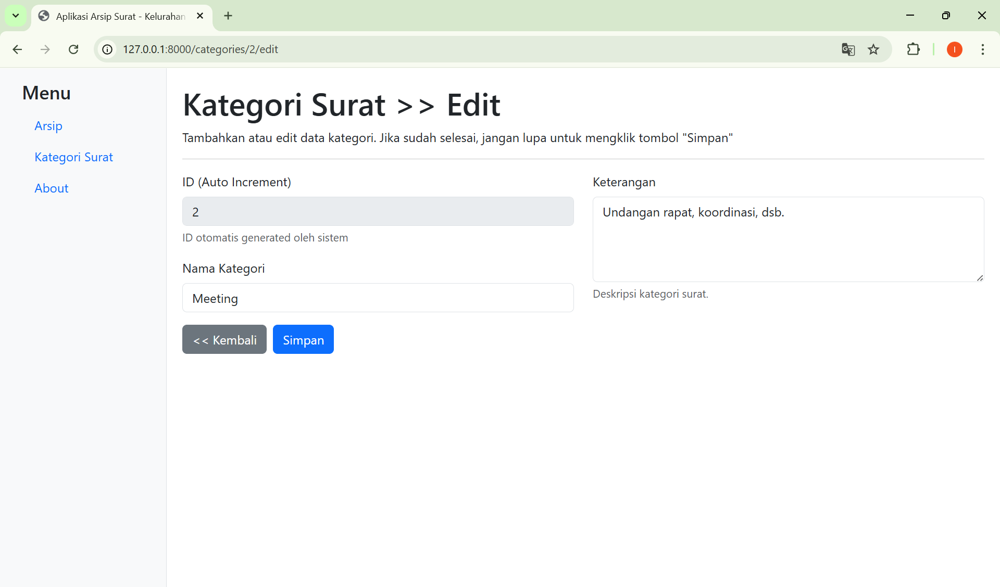
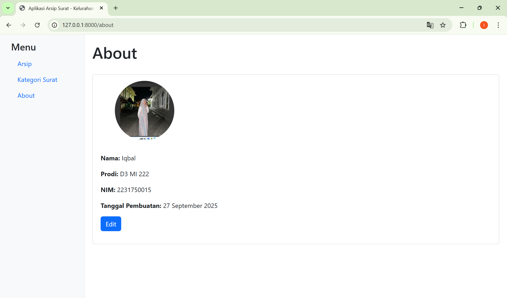
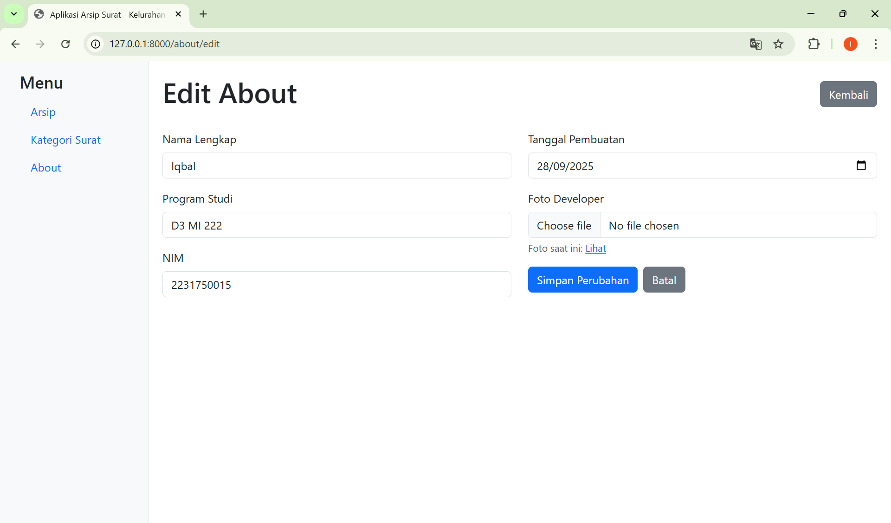

# 📂 Aplikasi Arsip Surat Kelurahan

## 🎯 Tujuan
Aplikasi ini dibuat untuk membantu kelurahan dalam mengarsipkan surat-surat resmi agar lebih mudah dikelola, dicari, serta diakses kembali jika diperlukan.

## ✨ Fitur
- Manajemen surat:
  - Tambah, edit, hapus surat
  - Upload file PDF surat
  - Unduh file PDF surat
- Pencarian surat berdasarkan:
  - Nomor surat
  - Kategori surat
  - Judul surat
- Manajemen kategori surat:
  - Tambah, edit, hapus kategori
  - Pencarian kategori berdasarkan **ID Kategori**, **Nama Kategori**, atau **Keterangan**
- Preview dokumen PDF langsung di aplikasi
- Update otomatis waktu unggah ketika surat diperbarui

## 🛠️ Teknologi yang Digunakan
- **Laravel 12** – Framework PHP
- **Bootstrap 5** – Tampilan UI
- **MySQL** – Database
- **phpMyAdmin** – Manajemen database
- **Composer & NPM** – Dependency management

## 🚀 Cara Menjalankan
```bash
1. Clone repository
   git clone https://github.com/iqballmaulanaa/Arsip_Surat_Kelurahan.git

2. Masuk ke folder project
   cd Arsip_Surat_Kelurahan

3. Install dependencies
   composer install
   npm install && npm run dev

4. Copy konfigurasi environment
   cp .env.example .env
   (Lalu sesuaikan konfigurasi database di file .env)

5. Generate key aplikasi
   php artisan key:generate

6. Import database
   - Buka phpMyAdmin
   - Buat database baru, misalnya arsip_surat_kelurahan
   - Import file .sql yang ada di folder database/

7. Jalankan server lokal
   php artisan serve
   (Aplikasi bisa diakses melalui http://localhost:8000)

## 📸 Screenshot Aplikasi

### Gambar 1: Halaman Arsip Surat (Daftar Surat)
Menampilkan daftar surat yang sudah diarsipkan.  
Terdapat fitur pencarian surat.  
Tabel berisi kolom: Nomor Surat, Kategori, Judul, Waktu Pengarsipan, dan Aksi (Hapus).  
Contoh data: Surat nomor 567 (kategori Pemberitahuan) dan 123 (kategori Nota Dinas).  


### Gambar 2: Form Unggah Surat Baru
Form untuk mengunggah surat baru ke arsip.  
Input yang diperlukan: Nomor Surat, Kategori, Judul, dan unggah file PDF.  
Terdapat preview kategori yang tersedia beserta keterangannya.  
Tombol aksi: Kembali dan Simpan.  


### Gambar 3: Halaman Lihat Surat (Preview Dokumen)
Menampilkan detail surat yang dipilih.  
Informasi yang ditampilkan: Nomor surat, kategori, judul, waktu unggah, dan preview dokumen.  
Dokumen preview berupa tiket konfirmasi dengan informasi pembayaran.  


### Gambar 4: Form Edit Surat
Form untuk mengedit surat yang sudah diarsipkan.  
Data yang dapat diubah: Kategori, Judul, dan file PDF (opsional).  
Menampilkan file saat ini yang tersimpan.  


### Gambar 5: Konfirmasi Hapus Surat
Dialog konfirmasi penghapusan surat dari arsip.  
Menanyakan apakah user yakin ingin menghapus arsip surat.  
Opsi: OK (hapus) atau Cancel (batal).  


### Gambar 6: Halaman Kategori Surat
Menampilkan daftar kategori surat yang tersedia.  
Fitur pencarian kategori.  
Tabel berisi: ID Kategori, Nama Kategori, Keterangan, dan Aksi (Hapus/Edit).  
Contoh kategori: Meeting, Nota Dinas, Pemberitahuan, Waspada.  


### Gambar 7: Form Tambah Kategori Baru
Form untuk menambahkan kategori surat baru.  
ID kategori di-generate otomatis oleh sistem.  
Input yang diperlukan: Nama Kategori dan Keterangan.  
Tombol aksi: Kembali dan Simpan.  


### Gambar 8: Form Edit Kategori
Form untuk mengedit kategori yang sudah ada.  
Menampilkan ID kategori (tidak dapat diubah) dan Nama Kategori yang dapat diedit.  
Juga menampilkan keterangan kategori.  
Tombol aksi: Kembali dan Simpan.  


### Gambar 9: Halaman About (Tampilan)
Menampilkan informasi tentang developer/pembuat sistem.  
Informasi: Nama, Program Studi, NIM, dan Tanggal Pembuatan.  
Data: Iqbal, D3 MI 222, 2231750015, 27 September 2025.  


### Gambar 10: Form Edit About
Form untuk mengedit informasi halaman About.  
Input yang dapat diubah: Nama Lengkap, Program Studi, NIM, Tanggal Pembuatan, dan Foto Developer.  
Menampilkan foto saat ini dan opsi untuk mengubahnya.  
Tombol aksi: Simpan Perubahan dan Batal.  

